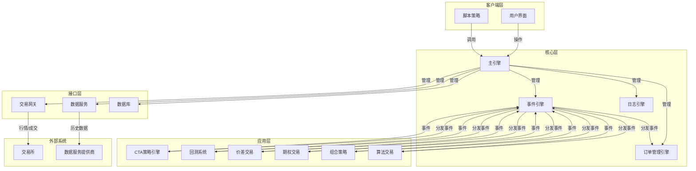

# VeighNa（vnpy）量化交易系统设计文档

## 1. 仓库概览

VeighNa是一套基于Python的开源量化交易系统开发框架，在开源社区持续不断的贡献下一步步成长为多功能量化交易平台。

### 主要功能/亮点：
- 支持多市场、多品种的交易接口（国内期货、证券、期权，海外市场等）
- 提供丰富的量化策略模块（CTA、套利、期权、组合策略等）
- 集成AI量化能力（vnpy.alpha模块），支持多因子机器学习策略
- 事件驱动架构，高效处理市场数据和交易信号
- 跨平台支持（Windows、Linux、MacOS）
- 丰富的可视化工具和回测系统

### 典型应用场景：
- 量化交易策略的开发、回测与实盘交易
- 机构投资者的自动化交易系统构建
- AI量化策略的研究与应用
- 多市场、多品种的投资组合管理

## 2. 目录结构

VeighNa项目采用模块化设计，核心功能集中在`vnpy`目录下，同时提供了丰富的文档、示例和测试。项目结构清晰，各模块职责明确，便于扩展和维护。

```text
├── vnpy/             # 核心代码目录
│   ├── alpha/        # AI量化模块（4.0新增）
│   ├── chart/        # K线图表模块
│   ├── event/        # 事件驱动引擎
│   ├── rpc/          # 跨进程通信模块
│   ├── trader/       # 交易核心模块
├── docs/             # 文档目录
├── examples/         # 示例代码
├── tests/            # 测试代码
├── README.md         # 项目说明
├── pyproject.toml    # 项目配置和依赖
```

### 核心模块说明：

| 模块名称 | 主要职责 | 文件位置 |
| ---- | ------- | -------- |
| alpha | AI量化策略开发，包含因子特征工程、模型训练等 | vnpy/alpha/ |
| chart | K线图表显示与实时数据更新 | vnpy/chart/ |
| event | 事件驱动引擎，处理系统内事件分发 | vnpy/event/ |
| rpc | 跨进程通信，支持分布式部署 | vnpy/rpc/ |
| trader | 交易核心，包含订单管理、网关对接等 | vnpy/trader/ |

## 3. 系统架构与主流程

VeighNa采用事件驱动的分层架构，通过事件引擎实现各模块间的解耦和通信。系统架构设计清晰，层次分明，便于扩展和维护。

### 核心架构组件：

1. **事件驱动引擎（EventEngine）**：系统的核心，负责事件的分发和处理，实现各模块间的解耦。
2. **主引擎（MainEngine）**：系统的中央控制器，管理所有网关和应用。
3. **网关（Gateway）**：负责与外部交易接口的对接，处理行情和交易指令。
4. **应用（App）**：实现具体功能的模块，如策略引擎、回测系统等。
5. **数据存储**：支持多种数据库适配器，用于存储行情和交易数据。

### 系统主流程：

1. **初始化阶段**：
   - 创建事件引擎和主引擎
   - 添加网关和应用
   - 初始化各引擎组件

2. **运行阶段**：
   - 连接交易接口
   - 订阅行情数据
   - 策略引擎处理行情数据并生成交易信号
   - 执行交易指令并处理成交回报
   - 更新持仓和账户信息

3. **关闭阶段**：
   - 停止事件引擎
   - 关闭所有网关和应用

### 架构示意图：



## 4. 核心功能模块

### 4.1 交易核心模块（trader）

交易核心模块是VeighNa的基础，提供了订单管理、账户管理、持仓管理等核心功能。

**主要功能**：
- 订单管理：处理委托下单、撤单等操作
- 账户管理：跟踪账户资金变化
- 持仓管理：实时更新持仓信息
- 合约管理：维护合约信息
- 事件处理：处理各类交易事件

**核心组件**：
- `MainEngine`：系统核心控制器，管理所有网关和应用
- `OmsEngine`：订单管理引擎，处理订单和成交
- `BaseGateway`：网关基类，定义了与交易接口对接的标准方法

### 4.2 AI量化模块（alpha）

AI量化模块是VeighNa 4.0版本的重要新增功能，提供了一站式多因子机器学习策略开发解决方案。

**主要功能**：
- 因子特征工程：支持高效批量特征计算与处理
- 预测模型训练：集成多种主流机器学习算法
- 策略投研开发：基于ML信号预测模型构建量化交易策略
- 投研流程管理：集成数据管理、模型训练、信号生成和策略回测等完整工作流程

**核心组件**：
- `dataset`：因子特征工程模块，内置Alpha 158等因子集合
- `model`：预测模型训练模块，支持Lasso、LightGBM、MLP等算法
- `strategy`：策略投研开发模块，支持截面多标的和时序单标的策略
- `lab`：投研流程管理模块，提供完整的工作流程支持

### 4.3 事件驱动引擎（event）

事件驱动引擎是VeighNa的核心组件，负责系统内事件的分发和处理，实现各模块间的解耦。

**主要功能**：
- 事件注册与分发
- 事件处理线程管理
- 定时器事件支持

**核心组件**：
- `EventEngine`：事件引擎核心，负责事件的分发和处理
- `Event`：事件对象，包含事件类型和数据

### 4.4 跨进程通信模块（rpc）

跨进程通信模块支持VeighNa的分布式部署，实现多进程间的通信。

**主要功能**：
- 客户端与服务端通信
- 远程方法调用
- 事件转发

**核心组件**：
- `RpcClient`：RPC客户端，用于连接服务端
- `RpcServer`：RPC服务端，处理客户端请求

### 4.5 K线图表模块（chart）

K线图表模块提供了高性能的K线图表显示功能，支持大数据量图表显示和实时数据更新。

**主要功能**：
- K线图表绘制
- 技术指标显示
- 实时数据更新

**核心组件**：
- `ChartWidget`：图表组件，负责K线图表的显示
- `ChartItem`：图表项，如K线、指标等

## 5. 核心 API/类/函数

### 5.1 MainEngine 类

**功能**：系统的核心控制器，管理所有网关和应用。

**主要方法**：
- `add_gateway(gateway_class, gateway_name)`：添加交易网关
- `add_app(app_class)`：添加应用模块
- `connect(setting, gateway_name)`：连接交易接口
- `subscribe(req, gateway_name)`：订阅行情
- `send_order(req, gateway_name)`：发送订单
- `cancel_order(req, gateway_name)`：撤单
- `query_history(req, gateway_name)`：查询历史数据

**应用场景**：作为系统的中央控制器，用于管理和协调各个组件的运行。

**源码位置**：[vnpy/trader/engine.py](file:///Users/bumblebee/workspace/finance/vnpy/vnpy/trader/engine.py)

### 5.2 EventEngine 类

**功能**：事件驱动引擎，负责事件的分发和处理。

**主要方法**：
- `register(event_type, handler)`：注册事件处理器
- `unregister(event_type, handler)`：取消注册事件处理器
- `put(event)`：放入事件
- `start()`：启动事件引擎
- `stop()`：停止事件引擎

**应用场景**：用于系统内各模块间的通信，实现解耦。

**源码位置**：[vnpy/event/engine.py](file:///Users/bumblebee/workspace/finance/vnpy/vnpy/event/engine.py)

### 5.3 BaseGateway 类

**功能**：交易网关基类，定义了与交易接口对接的标准方法。

**主要方法**：
- `connect(setting)`：连接交易接口
- `subscribe(req)`：订阅行情
- `send_order(req)`：发送订单
- `cancel_order(req)`：撤单
- `query_history(req)`：查询历史数据
- `close()`：关闭连接

**应用场景**：作为各种交易接口的基类，提供统一的接口标准。

**源码位置**：[vnpy/trader/gateway.py](file:///Users/bumblebee/workspace/finance/vnpy/vnpy/trader/gateway.py)

### 5.4 OmsEngine 类

**功能**：订单管理引擎，处理订单和成交。

**主要方法**：
- `get_tick(vt_symbol)`：获取最新行情
- `get_order(vt_orderid)`：获取订单
- `get_trade(vt_tradeid)`：获取成交
- `get_position(vt_positionid)`：获取持仓
- `get_account(vt_accountid)`：获取账户
- `get_contract(vt_symbol)`：获取合约
- `convert_order_request(req, gateway_name, lock, net)`：转换订单请求

**应用场景**：用于管理订单、成交、持仓和账户信息。

**源码位置**：[vnpy/trader/engine.py](file:///Users/bumblebee/workspace/finance/vnpy/vnpy/trader/engine.py)

### 5.5 Alpha模块相关类

**功能**：AI量化策略开发相关类。

**主要类**：
- `Dataset`：因子特征工程类
- `Model`：预测模型类
- `Strategy`：策略类
- `Lab`：投研流程管理类

**应用场景**：用于AI量化策略的开发、训练和回测。

**源码位置**：[vnpy/alpha/](file:///Users/bumblebee/workspace/finance/vnpy/vnpy/alpha/)

### 5.6 ChartWidget 类

**功能**：K线图表组件，负责K线图表的显示。

**主要方法**：
- `add_item(item)`：添加图表项
- `update_bar(bar)`：更新K线数据
- `set_data(data)`：设置历史数据

**应用场景**：用于K线图表的显示和实时更新。

**源码位置**：[vnpy/chart/widget.py](file:///Users/bumblebee/workspace/finance/vnpy/vnpy/chart/widget.py)

## 6. 技术栈与依赖

VeighNa使用了丰富的Python库和工具，以实现其功能。

| 类别 | 技术/依赖 | 用途 | 版本要求 | 源码位置 |
| ---- | --------- | ---- | -------- | -------- |
| 核心语言 | Python | 主要开发语言 | >=3.10 | [pyproject.toml](file:///Users/bumblebee/workspace/finance/vnpy/pyproject.toml) |
| GUI框架 | PySide6 | 图形界面 | ==6.8.2.1 | [pyproject.toml](file:///Users/bumblebee/workspace/finance/vnpy/pyproject.toml) |
| 数据处理 | numpy | 数值计算 | >=2.2.3 | [pyproject.toml](file:///Users/bumblebee/workspace/finance/vnpy/pyproject.toml) |
| 数据处理 | pandas | 数据处理 | >=2.2.3 | [pyproject.toml](file:///Users/bumblebee/workspace/finance/vnpy/pyproject.toml) |
| 数据处理 | polars | 高性能数据处理（alpha模块） | >=1.26.0 | [pyproject.toml](file:///Users/bumblebee/workspace/finance/vnpy/pyproject.toml) |
| 技术分析 | ta-lib | 技术指标计算 | >=0.6.4 | [pyproject.toml](file:///Users/bumblebee/workspace/finance/vnpy/pyproject.toml) |
| 机器学习 | scikit-learn | 机器学习算法（alpha模块） | >=1.6.1 | [pyproject.toml](file:///Users/bumblebee/workspace/finance/vnpy/pyproject.toml) |
| 机器学习 | lightgbm | 梯度提升决策树（alpha模块） | >=4.6.0 | [pyproject.toml](file:///Users/bumblebee/workspace/finance/vnpy/pyproject.toml) |
| 机器学习 | torch | 深度学习框架（alpha模块） | >=2.6.0 | [pyproject.toml](file:///Users/bumblebee/workspace/finance/vnpy/pyproject.toml) |
| 通信 | pyzmq | 消息队列 | >=26.3.0 | [pyproject.toml](file:///Users/bumblebee/workspace/finance/vnpy/pyproject.toml) |
| 可视化 | pyqtgraph | 图表绘制 | >=0.13.7 | [pyproject.toml](file:///Users/bumblebee/workspace/finance/vnpy/pyproject.toml) |
| 可视化 | plotly | 交互式图表 | >=6.0.0 | [pyproject.toml](file:///Users/bumblebee/workspace/finance/vnpy/pyproject.toml) |
| 工具 | loguru | 日志管理 | >=0.7.3 | [pyproject.toml](file:///Users/bumblebee/workspace/finance/vnpy/pyproject.toml) |
| 工具 | tqdm | 进度条 | >=4.67.1 | [pyproject.toml](file:///Users/bumblebee/workspace/finance/vnpy/pyproject.toml) |
| 工具 | deap | 遗传算法 | >=1.4.2 | [pyproject.toml](file:///Users/bumblebee/workspace/finance/vnpy/pyproject.toml) |

## 7. 关键模块与典型用例

### 7.1 行情数据源（datafeed）

VeighNa提供了标准化的数据服务接口`BaseDatafeed`（位于`vnpy.trader.datafeed`中），支持多种数据服务提供商。

#### 数据源配置

在全局配置中，和数据服务相关的字段：
- `datafeed.name`：数据服务接口的名称（必须为全称的小写英文字母）
- `datafeed.username`：数据服务的用户名
- `datafeed.password`：数据服务的密码（如果是token方式授权请填写在此字段）

#### 支持的数据源

| 数据源 | 说明 | 数据分类 | 数据周期 | 项目地址 |
| ---- | --- | ------- | ------- | -------- |
| 迅投研 | 睿智融科公司推出的专业数据服务，性价比高 | 股票、期货、期权、基金、合约信息、财务信息 | 日线、小时线、分钟线、TICK | [vnpy_xt](https://github.com/vnpy/vnpy_xt) |
| RQData | 米筐科技公司推出的云端数据服务 | 股票、期货、期权、基金、黄金TD | 日线、小时线、分钟线、TICK | [vnpy_rqdata](https://github.com/vnpy/vnpy_rqdata) |
| UData | 恒生电子推出的云端数据服务 | 股票、期货 | 分钟线（盘后更新） | [vnpy_udata](https://github.com/vnpy/vnpy_udata) |
| TuShare | 国内知名开源Python金融数据接口 | 股票、期货 | 日线、分钟线（盘后更新） | [vnpy_tushare](https://github.com/vnpy/vnpy_tushare) |
| TQSDK | 信易科技推出的Python程序化交易解决方案 | 期货 | 分钟线（实时更新） | [vnpy_tqsdk](https://github.com/vnpy/vnpy_tqsdk) |
| Wind | 万得Wind金融终端 | 期货 | 分钟线（实时更新） | [vnpy_wind](https://github.com/vnpy/vnpy_wind) |
| iFinD | 同花顺公司推出的金融数据终端 | 期货 | 分钟线（实时更新） | [vnpy_ifind](https://github.com/vnpy/vnpy_ifind) |
| Tinysoft | 天软.NET金融分析平台 | 期货 | 分钟线（实时更新） | [vnpy_tinysoft](https://github.com/vnpy/vnpy_tinysoft) |

#### 数据源使用示例

```python
from datetime import datetime
from vnpy.trader.constant import Exchange, Interval
from vnpy.trader.datafeed import get_datafeed
from vnpy.trader.object import HistoryRequest

# 获取数据服务实例
datafeed = get_datafeed()

# 配置数据源（需要在使用前配置）
from vnpy.trader.setting import SETTINGS
SETTINGS["datafeed.name"] = "rqdata"            # 选择数据服务
SETTINGS["datafeed.username"] = "license"       # 用户名
SETTINGS["datafeed.password"] = "your_token"    # 密码或token
```

#### 查询K线历史数据

```python
req = HistoryRequest(
    symbol="cu888",                    # 合约代码
    exchange=Exchange.SHFE,            # 交易所
    start=datetime(2019, 1, 1),       # 开始时间
    end=datetime(2021, 1, 20),         # 结束时间
    interval=Interval.DAILY            # 数据时间粒度
)

# 获取K线历史数据
data = datafeed.query_bar_history(req)
```

#### 查询Tick历史数据

```python
req = HistoryRequest(
    symbol="cu888",
    exchange=Exchange.SHFE,
    start=datetime(2019, 1, 1),
    end=datetime(2021, 1, 20),
    interval=Interval.TICK             # Tick级别数据
)

# 获取Tick历史数据
data = datafeed.query_tick_history(req)
```

**示例位置**：[examples/download_bars/download_bars.ipynb](file:///Users/bumblebee/workspace/finance/vnpy/examples/download_bars/download_bars.ipynb)

### 7.2 回测系统

VeighNa的回测系统位于`vnpy.alpha.strategy.backtesting`模块中的`BacktestingEngine`类，提供了完整的策略回测功能。

#### 回测引擎核心功能

**主要功能**：
- 历史数据加载与管理
- 策略信号模拟执行
- 逐日盯市盈亏计算
- 策略统计指标计算
- 可视化图表展示
- 性能分析对比

**核心组件**：
- `BacktestingEngine`：回测引擎核心，负责策略回测的整个流程
- `PortfolioDailyResult`：每日投资组合结果，计算每日盈亏

#### 回测引擎配置

```python
from vnpy.alpha.lab import AlphaLab
from vnpy.alpha.strategy.backtesting import BacktestingEngine
from vnpy.trader.constant import Interval
from datetime import datetime

# 创建投研实验室
lab = AlphaLab()

# 创建回测引擎
engine = BacktestingEngine(lab)

# 设置回测参数
engine.set_parameters(
    vt_symbols=["rb888.SHFE"],          # 交易合约列表
    interval=Interval.MINUTE,           # 数据周期
    start=datetime(2020, 1, 1),         # 回测开始时间
    end=datetime(2021, 1, 1),           # 回测结束时间
    capital=1_000_000,                  # 起始资金
    risk_free=0.03,                     # 无风险利率
    annual_days=240                     # 年交易日数
)
```

#### 加载历史数据

```python
# 加载历史数据
engine.load_data()
```

#### 运行回测

```python
# 添加策略
engine.add_strategy(strategy_class, strategy_settings, signal_df)

# 运行回测
engine.run_backtesting()
```

#### 计算回测结果

```python
# 计算逐日盯市盈亏
daily_df = engine.calculate_result()

# 计算策略统计指标
statistics = engine.calculate_statistics()
```

#### 统计指标输出

回测完成后，系统会输出以下统计指标：

| 指标 | 说明 |
| --- | --- |
| 首个交易日 | 回测期间第一个交易日 |
| 最后交易日 | 回测期间最后一个交易日 |
| 总交易日 | 回测总天数 |
| 盈利/亏损交易日 | 盈利和亏损的天数 |
| 起始/结束资金 | 回测开始和结束时的资金 |
| 总收益率 | 总体收益率 |
| 年化收益 | 年化收益率 |
| 最大回撤 | 最大资金回撤金额 |
| 百分比最大回撤 | 最大回撤百分比 |
| 最长回撤天数 | 最大回撤持续天数 |
| 总/日均盈亏 | 总盈亏和日均盈亏 |
| 总/日均手续费 | 总手续费和日均手续费 |
| Sharpe Ratio | 夏普比率 |
| 收益回撤比 | 收益与最大回撤的比值 |

#### 可视化展示

```python
# 显示回测图表（资金曲线、回撤、日盈亏等）
engine.show_chart()

# 显示策略表现（与基准对比）
engine.show_performance(benchmark_symbol="IF888.CFFEX")
```

#### 完整使用示例

```python
from vnpy.alpha.lab import AlphaLab
from vnpy.alpha.strategy.backtesting import BacktestingEngine
from vnpy.alpha.strategy import EquityDemoStrategy
from vnpy.trader.constant import Interval
from datetime import datetime

# 初始化
lab = AlphaLab()
engine = BacktestingEngine(lab)

# 配置回测参数
engine.set_parameters(
    vt_symbols=["rb888.SHFE", "hc888.SHFE"],
    interval=Interval.MINUTE,
    start=datetime(2020, 1, 1),
    end=datetime(2021, 1, 1),
    capital=1_000_000
)

# 加载数据
engine.load_data()

# 添加策略并运行
signal_df = lab.generate_signals()  # 生成信号
engine.add_strategy(EquityDemoStrategy, {}, signal_df)
engine.run_backtesting()

# 计算结果
engine.calculate_result()
statistics = engine.calculate_statistics()

# 可视化
engine.show_chart()
engine.show_performance("IF888.CFFEX")
```

**源码位置**：[vnpy/alpha/strategy/backtesting.py](file:///Users/bumblebee/workspace/finance/vnpy/vnpy/alpha/strategy/backtesting.py)

**示例Notebook**：
- [examples/alpha_research/research_workflow_lasso.ipynb](file:///Users/bumblebee/workspace/finance/vnpy/examples/alpha_research/research_workflow_lasso.ipynb)
- [examples/alpha_research/research_workflow_lgb.ipynb](file:///Users/bumblebee/workspace/finance/vnpy/examples/alpha_research/research_workflow_lgb.ipynb)
- [examples/alpha_research/research_workflow_mlp.ipynb](file:///Users/bumblebee/workspace/finance/vnpy/examples/alpha_research/research_workflow_mlp.ipynb)

### 7.3 CTA策略引擎

**功能说明**：CTA（Commodity Trading Advisor）策略引擎，用于开发和运行CTA类策略。

**配置与依赖**：
- 依赖：vnpy_ctastrategy模块
- 配置文件：策略配置文件，包含策略参数和运行设置

**使用示例**：

```python
from vnpy.event import EventEngine
from vnpy.trader.engine import MainEngine
from vnpy.trader.ui import MainWindow, create_qapp
from vnpy_ctp import CtpGateway
from vnpy_ctastrategy import CtaStrategyApp

def main():
    """启动VeighNa Trader"""
    qapp = create_qapp()
    event_engine = EventEngine()
    main_engine = MainEngine(event_engine)

    main_engine.add_gateway(CtpGateway)
    main_engine.add_app(CtaStrategyApp)

    main_window = MainWindow(main_engine, event_engine)
    main_window.showMaximized()
    qapp.exec()

if __name__ == "__main__":
    main()
```

**示例位置**：[examples/veighna_trader/run.py](file:///Users/bumblebee/workspace/finance/vnpy/examples/veighna_trader/run.py)

### 7.2 AI量化策略开发

**功能说明**：使用alpha模块开发AI量化策略，包括因子特征工程、模型训练和策略回测。

**配置与依赖**：
- 依赖：alpha模块及其依赖库（polars, scikit-learn, lightgbm, torch等）
- 数据：需要历史行情数据用于模型训练和回测

**使用示例**：

```python
# 基于Lasso回归模型的量化投研工作流
from vnpy.alpha.lab import Lab
from vnpy.alpha.dataset import Dataset
from vnpy.alpha.model import LassoModel
from vnpy.alpha.strategy import EquityDemoStrategy

# 创建投研实验室
lab = Lab()

# 准备数据
dataset = Dataset()
dataset.load_data("data.csv")
dataset.generate_features()

# 训练模型
model = LassoModel()
model.train(dataset)

# 回测策略
strategy = EquityDemoStrategy(model)
results = strategy.backtest(dataset)
print(results)
```

**示例位置**：[examples/alpha_research/research_workflow_lasso.ipynb](file:///Users/bumblebee/workspace/finance/vnpy/examples/alpha_research/research_workflow_lasso.ipynb)

### 7.3 行情记录模块

**功能说明**：实时录制Tick或K线行情到数据库中，用于策略回测或实盘初始化。

**配置与依赖**：
- 依赖：vnpy_datarecorder模块
- 配置：数据库配置和录制设置

**使用示例**：

```python
from vnpy.event import EventEngine
from vnpy.trader.engine import MainEngine
from vnpy.trader.ui import MainWindow, create_qapp
from vnpy_ctp import CtpGateway
from vnpy_datarecorder import DataRecorderApp

def main():
    """启动VeighNa Trader"""
    qapp = create_qapp()
    event_engine = EventEngine()
    main_engine = MainEngine(event_engine)

    main_engine.add_gateway(CtpGateway)
    main_engine.add_app(DataRecorderApp)

    main_window = MainWindow(main_engine, event_engine)
    main_window.showMaximized()
    qapp.exec()

if __name__ == "__main__":
    main()
```

**示例位置**：[examples/data_recorder/data_recorder.py](file:///Users/bumblebee/workspace/finance/vnpy/examples/data_recorder/data_recorder.py)

## 8. 配置、部署与开发

### 8.1 环境准备

- **系统要求**：Windows 11以上 / Windows Server 2022以上 / Ubuntu 22.04 LTS以上
- **Python版本**：Python 3.10以上（64位），推荐使用Python 3.13
- **推荐使用**：VeighNa团队为量化交易专门打造的Python发行版[VeighNa Studio](https://download.vnpy.com/veighna_studio-4.3.0.exe)，集成内置了VeighNa框架以及VeighNa Station量化管理平台

### 8.2 安装步骤

1. **从GitHub下载**：在[GitHub Releases](https://github.com/vnpy/vnpy/releases)下载Release发布版本
2. **运行安装脚本**：
   - Windows：`install.bat`
   - Ubuntu：`bash install.sh`
   - MacOS：`bash install_osx.sh`

### 8.3 开发流程

1. **创建应用**：继承`BaseApp`类创建自定义应用
2. **创建策略**：继承相应策略基类创建自定义策略
3. **添加网关**：实现`BaseGateway`接口添加新的交易接口
4. **测试与部署**：使用回测系统测试策略，然后部署到实盘

### 8.4 配置文件

- **全局配置**：`vnpy/trader/setting.py`中的`SETTINGS`字典
- **网关配置**：各交易网关的连接参数
- **应用配置**：各应用模块的配置参数

## 9. 监控与维护

### 9.1 日志系统

VeighNa使用`loguru`库实现了完善的日志系统，记录系统运行状态和错误信息。

**日志级别**：
- DEBUG：调试信息
- INFO：一般信息
- WARNING：警告信息
- ERROR：错误信息
- CRITICAL：严重错误信息

### 9.2 常见问题与解决方案

| 问题 | 可能原因 | 解决方案 |
| ---- | ------- | ------- |
| 连接失败 | 网络问题或账号密码错误 | 检查网络连接和账号密码 |
| 行情不更新 | 订阅失败或网络问题 | 检查订阅状态和网络连接 |
| 订单无法成交 | 价格不合适或市场流动性不足 | 调整订单价格或数量 |
| 策略性能不佳 | 策略参数不合适或市场环境变化 | 优化策略参数或调整策略逻辑 |

### 9.3 性能优化

- **使用异步IO**：对于REST和Websocket接口，使用异步IO提高性能
- **数据缓存**：合理使用数据缓存，减少数据库查询
- **代码优化**：优化策略代码，减少不必要的计算
- **硬件升级**：对于高频策略，考虑使用高性能硬件

## 10. 总结与亮点回顾

VeighNa是一款功能强大、架构清晰的量化交易系统开发框架，具有以下核心优势：

1. **模块化设计**：采用模块化设计，各组件职责明确，便于扩展和维护。
2. **多市场支持**：支持国内外多个市场的交易接口，包括期货、证券、期权等。
3. **丰富的策略模块**：提供多种量化策略模块，满足不同类型的交易需求。
4. **AI量化能力**：4.0版本新增的alpha模块，提供了强大的AI量化策略开发能力。
5. **事件驱动架构**：采用事件驱动架构，实现各模块间的解耦和高效通信。
6. **跨平台支持**：支持Windows、Linux、MacOS等多种操作系统。
7. **活跃的社区**：拥有活跃的社区和完善的文档，便于学习和使用。
8. **持续更新**：持续更新和改进，不断添加新功能和优化性能。

VeighNa的设计理念是"By Traders, For Traders, AI-Powered"，旨在为量化交易员提供专业、高效、易用的量化交易系统开发框架。通过不断的发展和完善，VeighNa已经成为国内量化交易领域的重要工具，为量化交易的发展做出了积极贡献。

未来，VeighNa将继续加强AI量化能力，拓展更多市场和品种的支持，提升系统性能和稳定性，为量化交易员提供更加全面、强大的工具和服务。
